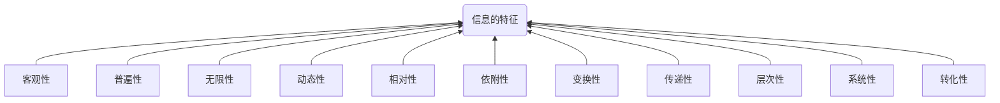
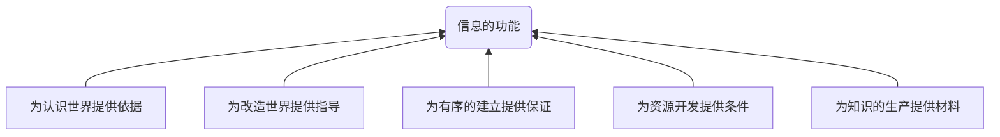

## 信息与信息系统

#### 一、基本概念

```mermaid
graph BT
a(信息的特征)
b[客观性]-->a
c[普遍性]-->a
d[无限性]-->a
e[动态性]-->a
f[相对性]-->a
g[依附性]-->a
h[变换性]-->a
i[传递性]-->a
j[层次性]-->a
k[系统性]-->a
l[转化性]-->a
```

<!--more-->

```mermaid
graph BT
a(信息的功能)
b[为认识世界提供依据]-->a
c[为改造世界提供指导]-->a
d[为有序的建立提供保证]-->a
e[为资源开发提供条件]-->a
f[为知识的生产提供材料]-->a
```
